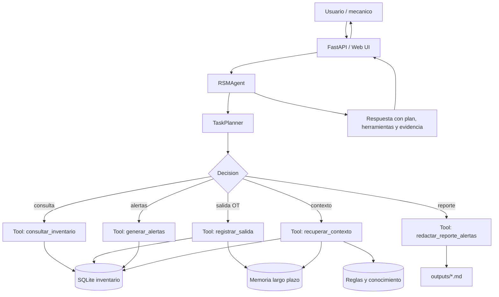

# RSM - Agente Funcional EP2

Proyecto funcional para la Evaluacion Parcial 2 de ISY0101. Implementa un agente local para gestion de inventario mecanico con herramientas de consulta, escritura y razonamiento, memoria de corto/largo plazo, recuperacion de contexto y planificacion adaptativa.

## Que incluye

- API FastAPI con interfaz web en `http://127.0.0.1:8000`.
- Herramientas LangChain (`StructuredTool`) para consultar inventario, registrar salidas, generar alertas, recuperar contexto y redactar reportes.
- Memoria corta por sesion y memoria larga persistente en SQLite.
- Recuperacion local de contexto desde inventario, reglas operativas y memoria.
- Planificador deterministico que decide el flujo segun la consulta del usuario.
- Tests unitarios y de API para evidenciar funcionamiento.
- Configuracion lista para Visual Studio Code.

## Documentos finales

- Informe Word: `docs/Informe_EP2_RSM_Agente_Funcional.docx`
- Informe PDF: `docs/Informe_EP2_RSM_Agente_Funcional.pdf`
- Diagrama de orquestacion: `docs/diagrama_orquestacion.mmd`
- Resumen de cambios: `docs/CAMBIOS_EP2.md`

## Ejecucion en Visual Studio Code

1. Abre la carpeta `rsm-agente-ep2` en Visual Studio Code o abre `rsm-agente-ep2.code-workspace`.
2. Instala la extension recomendada `Python` si VS Code la solicita.
3. Abre `Terminal > Run Task...`.
4. Ejecuta la tarea `Instalar dependencias`.
5. Ejecuta la tarea `Inicializar base de datos`.
6. Ejecuta la tarea `Ejecutar API`.
7. Abre `http://127.0.0.1:8000` en el navegador.

Tambien puedes presionar `F5` y elegir `RSM API (FastAPI)`.

## Ejecucion por terminal

```powershell
py -3 -m venv .venv
.\.venv\Scripts\python.exe -m pip install -r requirements.txt
.\.venv\Scripts\python.exe scripts\init_db.py
.\.venv\Scripts\python.exe -m uvicorn app.main:app --reload --host 127.0.0.1 --port 8000
```

Endpoints utiles:

- Web: `http://127.0.0.1:8000`
- Documentacion API: `http://127.0.0.1:8000/docs`
- Salud del sistema: `http://127.0.0.1:8000/health`
- Inventario: `http://127.0.0.1:8000/api/inventory`
- Alertas: `http://127.0.0.1:8000/api/alerts`

## Pruebas

```powershell
.\.venv\Scripts\python.exe -m pytest -q
```

El set de pruebas valida:

- Consulta de stock con recuperacion de contexto.
- Registro de salida con descuento real de inventario.
- Bloqueo de movimientos sin trazabilidad completa.
- Rechazo de salidas con stock insuficiente.
- API de salud y chat.

## Ejemplos de uso

```text
Cuantos filtros de aceite Toyota quedan?
Que items estan criticos o bajo minimo?
Registra salida de 2 unidades FO-TOY-001 para OT-778 con mecanico Ana y vehiculo Toyota Yaris 2020
Recomienda que debo reponer hoy
Genera un reporte de alertas de stock
```

## Arquitectura

El diagrama Mermaid esta en `docs/diagrama_orquestacion.mmd`.



## Alineacion con EP2

| Indicador | Evidencia en el proyecto |
|---|---|
| IE1 Herramientas autonomas | `app/tools.py` define herramientas de consulta, escritura y razonamiento. |
| IE2 Framework de agentes | Uso de `langchain-core` con `StructuredTool`. |
| IE3 Memoria de contenido | Tabla `memory` en SQLite y memoria corta por sesion. |
| IE4 Recuperacion de contexto | `app/retriever.py` recupera inventario, reglas y memoria relevante. |
| IE5 Planificacion | `app/planner.py` secuencia acciones por intencion. |
| IE6 Decisiones adaptativas | Bloquea salidas sin OT/mecanico/vehiculo y rechaza stock insuficiente. |
| IE7 README y diagrama | Este README y `docs/diagrama_orquestacion.mmd`. |
| IE8 Justificacion de componentes | Informe EP2 y seccion de arquitectura. |
| IE9 Informe tecnico | Documento entregable generado en `docs/`. |
| IE10 Lenguaje tecnico | README, tests e informe con evidencia concreta. |

## Referencias

LangChain. (2024). LangChain documentation. https://python.langchain.com/docs/

FastAPI. (2024). FastAPI documentation. https://fastapi.tiangolo.com/

SQLite. (2024). SQLite documentation. https://sqlite.org/docs.html
